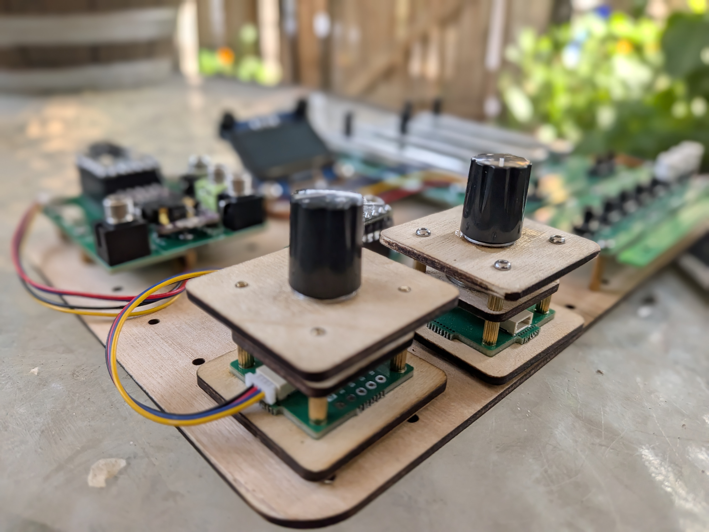
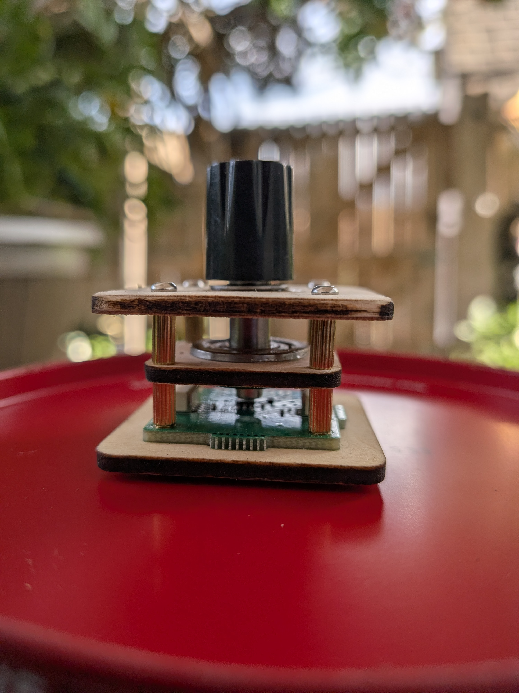
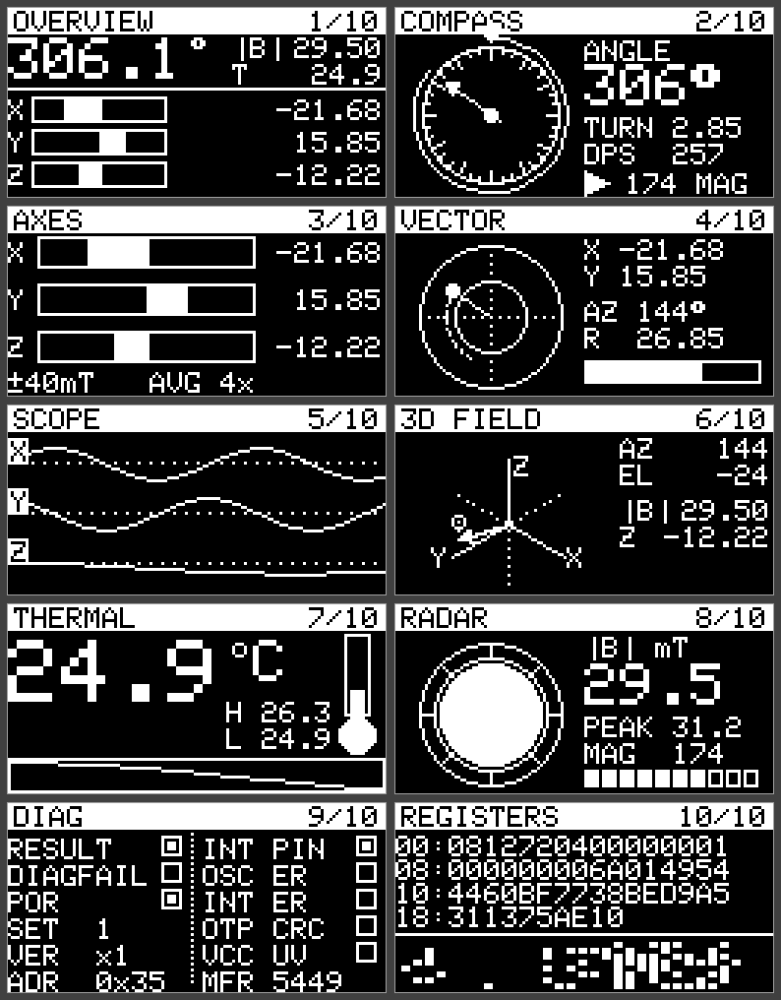

# EncoderAlchemy

Turn slowly. Land exactly where you mean to.

EncoderAlchemy is an Arduino library for magnetic rotary controls that need two kinds of movement: fine adjustment under the fingertips and quick travel across a large range. It reads an AMS AS5600 or TI TMAG5273 over I2C, tracks position across multiple turns, and turns angular speed into a controllable parameter increment.

We wrote it for instruments and hardware controls, then kept the API useful for ordinary Arduino projects. The source is here to inspect, adapt, and use with your own sensor board.

<p>
  
</p>

## The Velocity Encoder

We also make the Velocity Encoder, a magnetic encoder board that uses this library. It is populated with a TMAG5273B, which uses I2C address `0x35`. The same library works with compatible AS5600 and TMAG5273 breakout boards, so the code you start with can stay with your project.

Slow movement gives a small change. A faster turn moves through the same parameter range quickly. You can set the response curve, read the raw sensor data, or ignore the velocity layer and use it as a conventional encoder library.

<p>
  
</p>

## Supported sensors

| | AS5600 | TMAG5273 |
|---|---|---|
| Type | 12-bit on-axis magnetic encoder | 3D Hall-effect sensor with a CORDIC angle engine |
| Resolution | 4096 counts per revolution | 5760 counts per revolution, 1/16 degree |
| Default I2C address | `0x36` | `0x35` for A parts, with B, C, and D variants available |
| Supply | 3.3 V or 5 V, depending on the breakout board | 3.3 V only, 1.7 to 3.6 V |
| Extra data | Angle | X, Y, Z field in mT, die temperature, magnitude, diagnostics, and registers |

The encoder-facing API stays the same for both parts. Select the sensor in `MagEncoder::Config`, then use the same position, speed, and parameter methods.

## What the library does

- Reads raw angle, normalized angle, and degrees.
- Unwraps the sensor's zero crossing into a signed multi-turn position.
- Filters angular speed in degrees per second.
- Converts movement into a velocity-scaled parameter increment.
- Gives TMAG5273 projects access to three magnetic axes, temperature, diagnostics, configuration, and register access.
- Includes an optional `AlchemyOled` helper for 128×64 SH1106G readouts.

The core encoder code needs only `Wire` and an Arduino core with a working `TwoWire` implementation. The OLED helper uses Adafruit SH110X and Adafruit GFX.

## Wiring

### AS5600

| AS5600 pin | Connect to |
|---|---|
| VCC | 3.3 V or 5 V. Check the regulator on your breakout board. |
| GND | GND |
| SDA | Your board's SDA pin |
| SCL | Your board's SCL pin |

### TMAG5273

| TMAG5273 pin | Connect to |
|---|---|
| VCC | 3.3 V. The part accepts 1.7 to 3.6 V. |
| GND | GND |
| SDA | Your board's SDA pin |
| SCL | Your board's SCL pin |
| TEST | GND |
| INT | Optional. Connect it when your project uses interrupts. |

The Velocity Encoder board uses the A-addressed part at `0x35`. B, C, and D parts use factory-set addresses. Set the address explicitly when you know the fitted variant:

```cpp
cfg.i2cAddress = TMAG5273::ADDRESS_A;  // 0x35
cfg.i2cAddress = TMAG5273::ADDRESS_B;  // 0x22
cfg.i2cAddress = TMAG5273::ADDRESS_C;  // 0x78
cfg.i2cAddress = TMAG5273::ADDRESS_D;  // 0x44
```

Leave `i2cAddress` at `0` to use the selected sensor's library default: `0x36` for AS5600 and `0x35` for TMAG5273. The `I2CBusCheck` example helps inspect a shared bus before you debug a sensor sketch.

### Optional OLED

Any 128×64 SH1106G display can share the I2C bus. `AlchemyOled` uses address `0x3C` by default.

## Install

In the Arduino IDE, choose **Sketch → Include Library → Add .ZIP Library…** and select a ZIP of this repository. You can also place the library folder inside your Arduino sketchbook's `libraries` directory.

EncoderAlchemy builds on Arduino cores that provide `TwoWire`. Install **Adafruit SH110X** and **Adafruit GFX Library** from Library Manager when you want to use the OLED helper or its examples.

## Quick start

This sketch uses an AS5600, which is the default sensor. It calls `update()` every pass through `loop()`, then uses the consuming parameter method so each physical encoder count is applied once.

```cpp
#include <MagEncoder.h>

MagEncoder encoder;
float cutoff = 0.0f;

void setup()
{
    Serial.begin(115200);

    if (!encoder.begin())
        Serial.println("AS5600 not found. Check power, SDA, and SCL.");
}

void loop()
{
    if (!encoder.isConnected())
        return;

    encoder.update();

    const float change =
        encoder.takeParameterIncrement(0.0f, 1.0f, 4);
    cutoff = constrain(cutoff + change, 0.0f, 1.0f);
}
```

The final argument sets how many full rotations span the parameter range. In this example, four rotations cover `0.0` to `1.0`.

## Use a TMAG5273

Set the sensor type before constructing `MagEncoder`. The Velocity Encoder uses the A part at `0x35`.

```cpp
MagEncoder::Config cfg;
cfg.sensor = MagEncoder::Sensor::TMAG5273;
cfg.i2cAddress = TMAG5273::ADDRESS_A;

MagEncoder encoder(cfg);
```

When the address is already the selected sensor's default, this shorter form is enough:

```cpp
MagEncoder encoder(MagEncoder::Sensor::TMAG5273);
```

TMAG5273 readings run through the same `getCumulativePosition()`, `getAngularSpeed()`, and parameter-control methods as AS5600 readings. Its native raw-angle range is `0` through `5759`; use `getCountsPerRevolution()` when a sketch needs the exact value.

## Build a good control loop

`getParameterIncrement()` reports a velocity-scaled change derived from the most recent sensor movement. `update()` is rate-limited by `readIntervalMs`, so a fast loop can see that same movement more than once.

For most interactive controls, use `takeParameterIncrement()`. It drains the pending encoder ticks and applies every count once:

```cpp
encoder.update();
parameter = constrain(
    parameter + encoder.takeParameterIncrement(minValue, maxValue, turns),
    minValue,
    maxValue);
```

If your code uses `getParameterIncrement()`, apply it only after `getCumulativePosition()` changes. Call `clearPendingTicks()` when a mode or parameter selection changes, so movement made on one page does not alter the next page.

## Tune the feel

The defaults are the curve we use in our own instruments. They are a useful starting point. Every control has a different travel, range, and player behind it, so the curve belongs in the sketch:

```cpp
MagEncoder::Config cfg;
cfg.minVelDps         = 90.0f;    // Speed where the slow scale ends
cfg.maxVelDps         = 2400.0f;  // Speed where the fast scale tops out
cfg.minScale          = 0.008f;   // Fine movement multiplier
cfg.maxScale          = 3.2f;     // Fast movement multiplier
cfg.curveExponent     = 1.8f;     // Middle of the response curve
cfg.velocitySmoothing = 0.08f;    // Smaller values smooth more

MagEncoder encoder(cfg);
```

`readIntervalMs` sets the minimum time between sensor reads. It defaults to 5 ms, so calling `update()` every loop is safe.

## Read the TMAG5273 data

With a TMAG5273 selected, `encoder.tmag()` gives you the underlying driver. `encoder.update()` already refreshed it, so these reads do not start another sensor transaction.

```cpp
TMAG5273 &mag = encoder.tmag();

encoder.update();

const float bx = mag.getX();               // mT
const float by = mag.getY();               // mT
const float bz = mag.getZ();               // mT
const float temperature = mag.getTemperature();
const float angle = mag.getAngle();        // degrees
const float field = mag.getFieldMagnitude();

if (mag.getDeviceStatus().vccUnderVolt)
{
    // Handle a supply-voltage fault.
}
```

You can also use the TMAG5273 driver without `MagEncoder`:

```cpp
#include <TMAG5273.h>

TMAG5273::Config cfg;
cfg.channels = TMAG5273::MagChannels::XYZ;
cfg.anglePair = TMAG5273::AnglePair::XY;
cfg.averaging = TMAG5273::ConvAvg::X16;

TMAG5273 sensor(cfg);
sensor.begin();
sensor.update();
```

## OLED readouts

`AlchemyOled` adds compact drawing helpers on top of `Adafruit_SH1106G`: title bars, bar meters, dials, arcs, ring gauges, vectors, and sparklines. Include the Adafruit headers in the sketch before `AlchemyOled.h` so the Arduino builder finds the display libraries.

```cpp
#include <Adafruit_GFX.h>
#include <Adafruit_SH110X.h>
#include <AlchemyOled.h>

AlchemyOled oled;

void setup()
{
    oled.begin();  // false when the panel does not respond
}

void draw(float value)
{
    oled.clear();
    oled.title("FIELD", "1/8");
    oled.bipolarBar(2, 16, 100, 9, value, 40.0f);
    oled.ringGauge(96, 40, 18, 4, value / 40.0f);
    oled.at(0, 5).print("Bx ");
    oled.gfx().print(value, 2);
    oled.show();
}
```

`gfx()` exposes the Adafruit display object for drawing that sits outside the helper's vocabulary.

## API reference

### `MagEncoder::Config`

| Field | Default | Meaning |
|---|---|---|
| `sensor` | `Sensor::AS5600` | The fitted sensor. |
| `i2cAddress` | `0` | Uses the selected sensor default, `0x36` or `0x22`. |
| `readIntervalMs` | `5` | Minimum time between sensor reads. |
| `minVelDps` / `maxVelDps` | `90` / `2400` | Speed range used by the response curve. |
| `minScale` / `maxScale` | `0.008` / `3.2` | Fine and fast movement multipliers. |
| `curveExponent` | `1.8` | Shape of the curve's middle range. |
| `velocitySmoothing` | `0.08` | Velocity-scale EMA factor. Smaller values add smoothing. |
| `tmag` | TMAG5273 defaults | TMAG5273 configuration, ignored for AS5600. |

### Setup and polling

| Method | Meaning |
|---|---|
| `bool begin(TwoWire& = Wire)` | Starts I2C and detects the configured sensor. Pass `Wire1` to use a second bus. |
| `void update()` | Refreshes the sensor and derived state. The method follows `readIntervalMs`. |
| `bool isConnected()` | Reports whether `begin()` found the sensor. |

### Position and velocity

| Method | Meaning |
|---|---|
| `uint16_t getRawAngle()` | Native angle counts: 0 to 4095 for AS5600, or 0 to 5759 for TMAG5273. |
| `float getNormalizedAngle()` | Angle mapped to 0.0 through 1.0. |
| `float getAngleDegrees()` | Shaft angle in degrees. |
| `int32_t getCumulativePosition()` | Signed, multi-turn position with wrap-around removed. |
| `float getAngularSpeed()` | Filtered angular speed in degrees per second. |
| `float getPositionPercentage(maxRotations)` | Cumulative position mapped across a chosen number of turns. |
| `VelocityZone getVelocityZone()` | One of `Idle`, `Low`, `Mid`, or `High`. |
| `Sensor getSensor()` / `const char* getSensorName()` | The configured sensor. |
| `uint8_t getI2CAddress()` | Active 7-bit I2C address. |
| `uint16_t getCountsPerRevolution()` | 4096 for AS5600 or 5760 for TMAG5273. |

### Parameter control

| Method | Meaning |
|---|---|
| `float getParameterIncrement(min, max, maxRotations)` | Velocity-scaled change based on the most recent sensor movement. Gate it on a new position. |
| `float takeParameterIncrement(min, max, maxRotations)` | Consuming version for normal fast loops. Each pending count is used once. |
| `int32_t pendingTicks()` / `void clearPendingTicks()` | Inspect or discard undrained movement. Clear it after a page or mode change. |
| `float getVelocityScale()` | Current multiplier for display or diagnostics. |
| `float mapPositionToRange(min, max, maxRotations)` | Maps the absolute multi-turn position with no velocity scaling. |

### State and TMAG5273 access

| Method | Meaning |
|---|---|
| `void resetCumulativePosition(position = 0)` | Resets the multi-turn count and its baseline. |
| `TMAG5273& tmag()` | Gives access to the underlying TMAG5273 driver. Use it when the selected sensor is TMAG5273. |

### `TMAG5273`

| Method group | Meaning |
|---|---|
| `begin()`, `update()`, `isConnected()` | Start, refresh, and inspect the driver connection. |
| `getX()`, `getY()`, `getZ()`, `getFieldMagnitude()` | Magnetic field readings in mT. |
| `getRawX()`, `getRawY()`, `getRawZ()`, `getMagnitude()` | Native sensor readings. |
| `getAzimuth()`, `getElevation()`, `getAngle()`, `getRawAngle()` | Field direction and CORDIC angle. |
| `getTemperature()`, `getConversionStatus()`, `getDeviceStatus()` | Thermal and diagnostic data. |
| `getVersion()`, `getVersionName()`, `getManufacturerId()` | Device identification. |
| `getRangeXY()`, `getRangeZ()` | The fitted part's full-scale field ranges. |
| `setMagChannels()`, `setTemperatureChannel()`, `setAnglePair()` | Select conversion channels and angle axes. |
| `setAveraging()`, `setTempCo()`, `setOperatingMode()`, `setSleepTime()` | Set conversion and power behavior. |
| `setRanges()`, `setLowNoiseMode()` | Choose sensitivity and noise/current trade-offs. |
| `setMagneticGain()`, `setMagneticOffsets()`, `setMagneticThresholds()` | Configure magnetic trim and thresholds. |
| `setInterrupt()`, `triggerConversion()`, `clearStatusFlags()` | Work with the INT pin and conversion flags. |
| `readRegister()`, `writeRegister()`, `readRegisters()`, `readRegisterMap()` | Direct register access. |

### `AlchemyOled`

Text: `at`, `atPixel`, `text`, `textCentered`, `textRight`, `textWidth`, `title`.

Meters: `bar`, `barVertical`, `bipolarBar`, `segmentBar`.

Round drawing: `dial`, `needle`, `arc`, `ringGauge`, `polar`, `arrowHead`, `vector`.

Plots: `sparkline`, `dottedHLine`, `dottedVLine`, `plotFrame`.

Frame control: `clear`, `show`, `gfx`.

## Examples

- **VelocitySensitiveKnob** adjusts a floating-point parameter with velocity scaling. It can show the value, speed, and velocity zone on an OLED.
- **TMAG5273Explorer** presents the TMAG5273's angle, magnetic field, temperature, and diagnostics on cycling OLED views.
- **I2CBusCheck** checks SDA and SCL idle levels, then scans the I2C bus at 100 kHz and 400 kHz.



The image is rendered from the example's frame buffers with simulated sensor motion. It shows the display layout, rather than a photograph of a finished panel.

## License

MIT. See [LICENSE](LICENSE).
